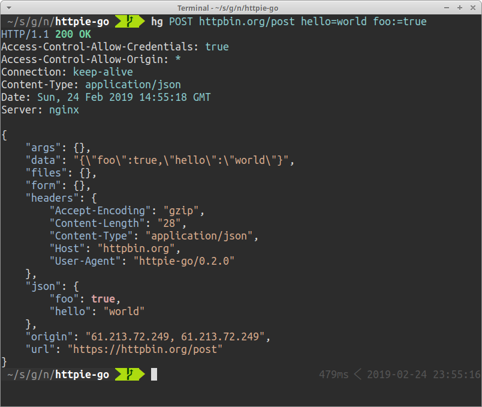

# httpie-go

[](https://circleci.com/gh/nojima/httpie-go)



**httpie-go** (`ht`) is a user-friendly HTTP client CLI.
Requests can be issued with fewer types compared to `curl`.
Responses are displayed with syntax highlighting.

httpie-go is a clone of [httpie](https://httpie.org/).
Since httpie-go is written in Go, it is a single binary and does not require a heavy runtime.

## Examples

This example sends a GET request to http://httpbin.org/get.

```bash
$ ht GET httpbin.org/get
```

The second example sends a POST request with JSON body `{"hello": "world", "foo": "bar"}`.

```bash
$ ht POST httpbin.org/post hello=world foo=bar
```

You can see the request that is being sent with `-v` option.

```bash
$ ht -v POST httpbin.org/post hello=world foo=bar
```

Request HTTP headers can be specified in the form of `key:value`.

```bash
$ ht -v POST httpbin.org/post X-Foo:foobar
```

Disable TLS verification.

```bash
$ ht --verify=no https://httpbin.org/get
```

Download a file.

```bash
$ ht --download <any url you want>
```

## Documents

Although httpie-go does not currently have documents, you can refer to the original [httpie's documentation](https://httpie.org/doc) since httpie-go is a clone of httpie.
Note that some minor options are yet to be implemented in httpie-go.

## How to build

```
make
```

For non-standard Linux system like Android [termux](https://termux.com/), use following method to avoid the DNS issue.

```
make build-termux
```


# How build tags work.

We use build tags or build constraints to separate build process for different platforms. Build tags are found at the top of the file as a comment. The file will be included only if the tag is present in the build command.
eg: 
```go
//go:build cli
```
#### build command using wasm tag
```sh
GOOS=js GOARCH=wasm go build -tags=wasm  -o static/main.wasm
```
#### build command using cli tag

```sh
go build -tags=cli  -o static/main.wasm
```

Note : The first line of the file should be followed by an empty line to make it a valid build tag statement.

If there is an `!` mark then it means the `not` operation on the build tags.

```go
//go:build !windows
```
This will exclude the file if a `windows` build tag is used.(eg: while building for unix based systems) 

Here we have `wasm` and `cli` build tags to switch between wasm and cli builds.

`//+build` is the older syntax for build tags, it's still recognized in Go. You can convert these statements into new syntax using `gofmt` command.

## platform related build tags.

**Example:**

```go
//go:build (linux && 386) || (darwin && !cgo)
```
This means the file will be included if the target is either "linux" with "386" architecture or "darwin" without "cgo".

#### Environment Variables

- **GOOS**: Sets the target operating system.
- **GOARCH**: Sets the target architecture.

During a build, the following tags are considered:

- **Target OS**: Defined by `runtime.GOOS` (set by `GOOS`).
- **Target Architecture**: Defined by `runtime.GOARCH` (set by `GOARCH`).
- **Architecture Features**: For example, "amd64.v2".
- **"unix"**: If `GOOS` is a Unix-like system.
- **Compiler**: Either "gc" or "gccgo".
- **"cgo"**: If `cgo` is supported (set by `CGO_ENABLED`).
- **Go Version**: Tags like "go1.1", "go1.12", etc.
- **Custom Tags**: Provided by the `-tags` flag.

#### Implicit Build Constraints
Files can have implicit build constraints based on their names:

- **\*_GOOS**
- **\*_GOARCH**
- **\*_GOOS_GOARCH**

For example, `source_windows_amd64.go` is implicitly constrained to `GOOS=windows` and `GOARCH=amd64`.

#### Special Cases
- **GOOS=android**: Matches tags and files for both `GOOS=linux` and `android`.
- **GOOS=illumos**: Matches tags and files for both `GOOS=solaris` and `illumos`.
- **GOOS=ios**: Matches tags and files for both `GOOS=darwin` and `ios`.

This ensures compatibility and proper inclusion of files for these specific platforms.

By using these build tags and environment variables, you can control the inclusion of files in your Go package based on the target platform.